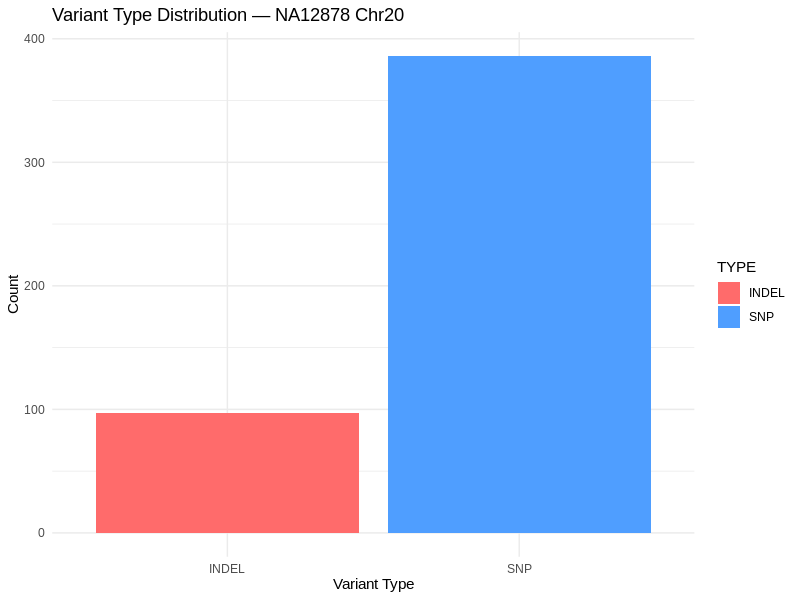
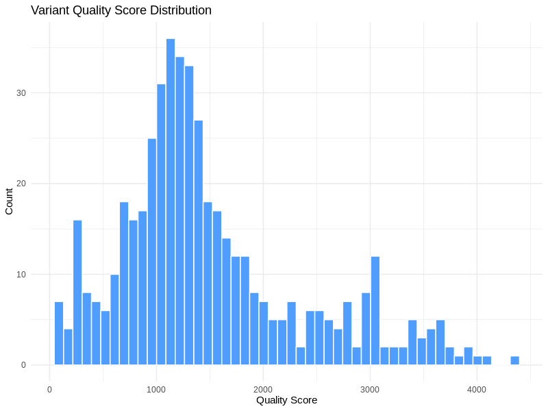

# Variant Calling Pipeline: NA12878 Chr20

GATK4 best practices variant calling pipeline.

## Results
- 225,089 reads aligned to chr20 (98.86% mapping rate)
- 13% duplication rate
- 483 high confidence variants (386 SNPs, 97 INDELs)

## Pipeline
BWA-MEM alignment → MarkDuplicates → HaplotypeCaller → 
GenotypeGVCFs → Hard Filtering

## Tools
GATK4, BWA-MEM, samtools, Ubuntu, conda

## Visualizations

### Variant Type Distribution

### Quality Score Distribution

